# Database ER Diagram – Normalized Training Management System

Mermaid ER diagram with **Core** (blue), **Financial** (green), and **Documents & Support** (orange) groups.

```mermaid
erDiagram
  %% ========== CORE ENTITIES (Blue) ==========
  CUSTOMERS {
    bigint id PK "PK"
    string first_name "NOT NULL"
    string last_name "NOT NULL"
    string email "NOT NULL, UNIQUE"
    string phone
    string company_name
    string tax_id
    text address
    string province
    datetime created_at "NOT NULL"
    datetime updated_at "NOT NULL"
  }

  TRAINING_CLASSES {
    bigint id PK "PK"
    string title "NOT NULL"
    text description
    date start_date "NOT NULL"
    date end_date
    time start_time
    time end_time
    string location "NOT NULL"
    bigint instructor_id FK "FK -> instructors"
    int max_attendees
    string status "NOT NULL"
    datetime created_at "NOT NULL"
    datetime updated_at "NOT NULL"
  }

  ATTENDANCES {
    bigint id PK "PK"
    bigint training_class_id FK "NOT NULL, FK -> training_classes"
    bigint customer_id FK "NOT NULL, FK -> customers"
    string participant_type "Indi|Corp"
    int seats "DEFAULT 1"
    string source_channel
    string status "attendee|potential"
    date attendance_date
    text notes
    datetime created_at "NOT NULL"
    datetime updated_at "NOT NULL"
  }

  %% ========== FINANCIAL (Green) ==========
  CLASS_PRICING {
    bigint id PK "PK"
    bigint training_class_id FK "UNIQUE, FK -> training_classes"
    decimal base_price "precision 10,2"
    decimal vat_rate "precision 5,4 DEFAULT 0.07"
    decimal early_bird_price "precision 10,2"
    date early_bird_deadline
    string currency "DEFAULT THB"
    datetime created_at "NOT NULL"
  }

  PAYMENTS {
    bigint id PK "PK"
    bigint attendance_id FK "NOT NULL, FK -> attendances"
    decimal amount "precision 10,2 NOT NULL"
    string payment_method
    date payment_date
    string payment_status "Pending|Paid"
    string invoice_number
    string receipt_number
    date due_date
    datetime created_at "NOT NULL"
    datetime updated_at "NOT NULL"
  }

  PROMOTIONS {
    bigint id PK "PK"
    string name "NOT NULL"
    string promotion_type "percentage|fixed|buy_x_get_y (use promotion_type to avoid Rails STI)"
    decimal discount_value "precision 10,2"
    decimal discount_percentage "precision 5,2"
    int max_uses
    date start_date
    date end_date
    datetime created_at "NOT NULL"
    datetime updated_at "NOT NULL"
  }

  PROMOTION_APPLICATIONS {
    bigint id PK "PK"
    bigint attendance_id FK "NOT NULL, FK -> attendances"
    bigint promotion_id FK "NOT NULL, FK -> promotions"
    decimal discount_amount "precision 10,2"
    date applied_date "NOT NULL"
  }

  %% ========== DOCUMENTS & SUPPORT (Orange) ==========
  DOCUMENTS {
    bigint id PK "PK"
    bigint attendance_id FK "NOT NULL, FK -> attendances"
    string document_type "QT|INV|Receipt"
    string file_key
    string file_name
    datetime created_at "NOT NULL"
  }

  EXPORT_JOBS {
    bigint id PK "PK"
    string export_type "NOT NULL"
    string format "NOT NULL"
    string state "NOT NULL"
    bigint requested_by_id FK "FK -> admin_users"
    datetime created_at "NOT NULL"
    datetime updated_at "NOT NULL"
  }

  %% ========== SUPPORTING TABLES ==========
  INSTRUCTORS {
    bigint id PK "PK"
    string first_name "NOT NULL"
    string last_name "NOT NULL"
    string email
    string phone
    text bio
    decimal rate "precision 10,2"
    datetime created_at "NOT NULL"
    datetime updated_at "NOT NULL"
  }

  CLASS_EXPENSES {
    bigint id PK "PK"
    bigint training_class_id FK "NOT NULL, FK -> training_classes"
    string category
    decimal amount "precision 10,2 NOT NULL"
    text description "NOT NULL"
    datetime created_at "NOT NULL"
  }

  ADMIN_USERS {
    bigint id PK "PK"
    string email "NOT NULL, UNIQUE"
    string password_digest "NOT NULL"
    datetime created_at "NOT NULL"
    datetime updated_at "NOT NULL"
  }

  CUSTOM_FIELDS {
    bigint id PK "PK"
    string entity_type "NOT NULL"
    string key "NOT NULL"
    string label "NOT NULL"
    string field_type "DEFAULT string"
    boolean active "DEFAULT true"
    datetime created_at "NOT NULL"
    datetime updated_at "NOT NULL"
  }

  CUSTOM_FIELD_VALUES {
    bigint id PK "PK"
    bigint custom_field_id FK "NOT NULL, FK -> custom_fields"
    string record_type "NOT NULL"
    bigint record_id "NOT NULL"
    text value
    datetime created_at "NOT NULL"
    datetime updated_at "NOT NULL"
  }

  %% ========== RELATIONSHIPS ==========
  %% Core: (1) --< (Many)
  CUSTOMERS ||--o{ ATTENDANCES : "registers"
  TRAINING_CLASSES ||--o{ ATTENDANCES : "has"
  TRAINING_CLASSES ||--o| CLASS_PRICING : "has"
  TRAINING_CLASSES }o--|| INSTRUCTORS : "instructor"
  TRAINING_CLASSES ||--o{ CLASS_EXPENSES : "has"

  %% Financial
  ATTENDANCES ||--o{ PAYMENTS : "has"
  ATTENDANCES ||--o{ PROMOTION_APPLICATIONS : "has"
  PROMOTIONS ||--o{ PROMOTION_APPLICATIONS : "applied_to"

  %% Documents & Support
  ATTENDANCES ||--o{ DOCUMENTS : "has"
  ADMIN_USERS ||--o{ EXPORT_JOBS : "requested_by"

  %% Custom fields (polymorphic)
  CUSTOM_FIELDS ||--o{ CUSTOM_FIELD_VALUES : "has"
```

---

## Color coding (conceptual)

| Group | Color | Tables |
|-------|--------|--------|
| **Core** | Blue | customers, training_classes, attendances |
| **Financial** | Green | class_pricing, payments, promotions, promotion_applications |
| **Documents & Support** | Orange | documents, export_jobs |
| **Supporting** | — | instructors, class_expenses, admin_users, custom_fields, custom_field_values |

---

## Cardinality

| Relationship | Cardinality |
|--------------|-------------|
| customers ↔ attendances | 1 —< Many |
| training_classes ↔ attendances | 1 —< Many |
| training_classes ↔ class_pricing | 1 —\| 1 |
| training_classes ↔ instructor | Many —\| 1 |
| attendances ↔ payments | 1 —< Many |
| attendances ↔ documents | 1 —< Many |
| attendances ↔ promotion_applications | 1 —< Many |
| promotions ↔ promotion_applications | 1 —< Many |
| Unique constraint | (training_class_id, customer_id) on attendances |

---

## Indexes (from migrations)

- All foreign key columns have indexes.
- `attendances(training_class_id, customer_id)` UNIQUE.
- `customers(email)` UNIQUE.
- `custom_field_values(record_type, record_id, custom_field_id)` UNIQUE.
